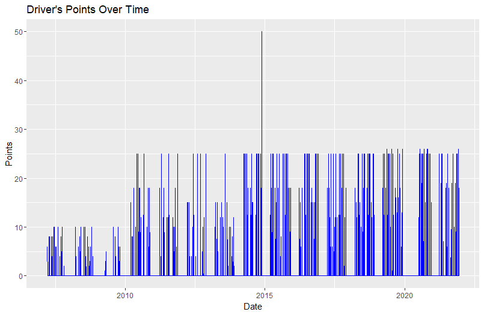

# Advanced Time Series Models for F1 Race Outcome Prediction

This repository contains R scripts that analyze and forecast Formula 1 race outcomes using advanced time series models. The project utilizes tools and libraries for data wrangling, visualization, and predictive modeling to derive meaningful insights from F1 race data.

## Key Features
- **Data Cleaning & Transformation**:
  - Handles missing values with strategies like imputation.
  - Creates time-based features, cumulative metrics, and moving averages.
- **Time Series Analysis**:
  - Ensures continuity of time series data for each driver.
  - Implements ARIMA models to forecast race performance metrics.
- **Predictive Analytics**:
  - Uses logistic regression to predict top-10 finishes.
  - Evaluates model accuracy and performance.
- **Visualization**:
  - Plots drivers' points over time.
  - Compares actual and predicted top-10 finishes.
  - Displays forecasted performance trends.

## Dependencies
### R Packages
Ensure the following R packages are installed:
- `readxl`
- `dplyr`
- `lubridate`
- `ggplot2`
- `tidyr`
- `modeltime`
- `tidymodels`
- `timetk`
- `zoo`
- `fable`
- `forecast`

Install missing packages with:
```R
install.packages(c("readxl", "dplyr", "lubridate", "ggplot2", "tidyr", "timetk", "zoo", "fable", "forecast"))
```

## Data Preparation
### Input File
- **File Name:** `F1 data.xlsx`
- **Sheet:** `results`

Place the file in the specified path and update the `file_path` variable in the script with the correct file location.

### Columns Used
- `code`: Driver identifier
- `date`: Race date
- `points`: Driver points
- `position`: Final position
- `fastestLapSpeed`: Fastest lap speed
- `laps`: Total laps completed

## Workflow
1. **Preprocessing:**
   - Removes rows with missing or invalid data.
   - Computes cumulative points and rolling averages.
2. **Time Series Modeling:**
   - Fits an ARIMA model to historical data.
   - Forecasts performance metrics for future races.
3. **Classification Modeling:**
   - Logistic regression predicts the likelihood of a driver finishing in the top 10.
4. **Evaluation:**
   - Measures forecast accuracy and classification accuracy.

## Example Workflow
### Running the Script
1. Load necessary libraries.
2. Specify the file path to the dataset.
3. Execute each section of the script:
   - Data cleaning
   - Time series modeling
   - Logistic regression modeling
4. Review outputs:
   - Forecasts saved as CSV files.
   - Visualizations plotted inline.

### Forecast Output
- **File Name:** `future_forecast.csv`
- Contains 12-month race performance forecasts for selected drivers.

### Predicted Accuracy
- Displays percentage accuracy for the classification model.

## Visualizations
- **Driver Points Over Time:**
  

- **Forecast vs Actual:**
  
  

- **Future Performance forecast:**
  
  
- **Top-10 Prediction Comparison:**
  
  
## Future Enhancements
- Add automated feature engineering for non-linear trends.
- Support for external race factors like weather or circuit characteristics.
- Explore advanced machine learning models for better predictions.

## Contact
For questions or contributions, feel free to open an issue or submit a pull request.
